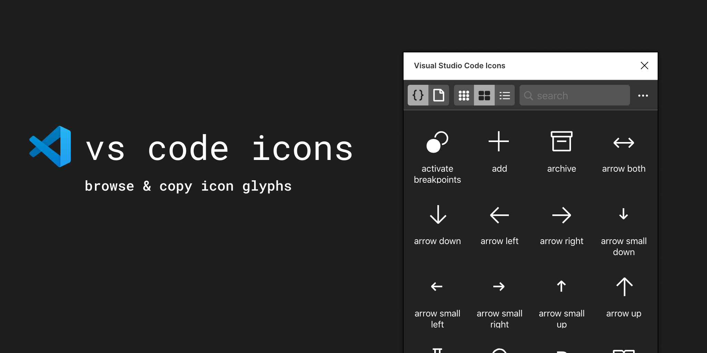

This plugin was originally forked from the [Symbol Icons Browser](https://github.com/kudakurage/figma-symbols-browser) and re-purposed to use for Visual Studio Code icons. You must Install the fonts below before starting:

- [Codicons](https://github.com/microsoft/vscode-codicons/blob/master/dist/codicon.ttf)
- [Seti](https://github.com/jesseweed/seti-ui/blob/master/styles/_fonts/seti/seti.ttf)

# Usage
1. Find the symbol you want to use
2. Click the symbol

# Options
- Copy: copy symbol glyph to clipboard
- Copy & Paste: copy and paste symbol glyph to selected text objects
- Create: create new symbol glyph as a text object on the canvas